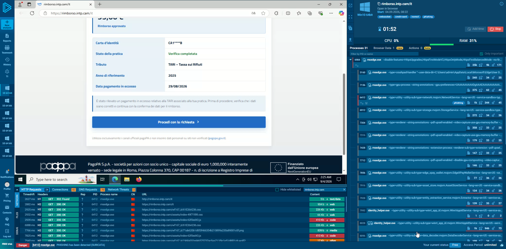
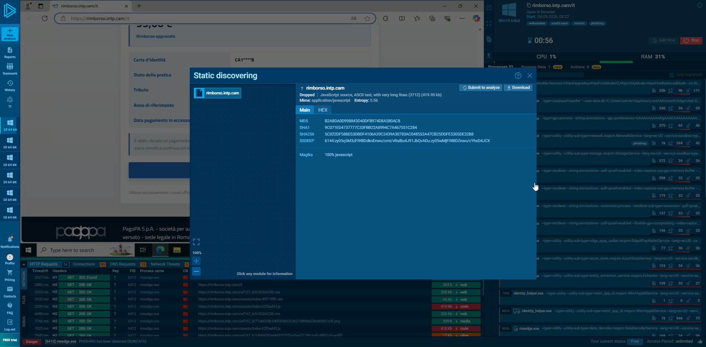

# Case 002 — PagoPA / TARI Refund Phishing Campaign

> Independent threat research case study focused on a phishing campaign targeting Italian users through a fake TARI refund impersonating PagoPA.

## Overview

This case study documents an independent analysis of a phishing campaign impersonating **PagoPA** and using a fake **TARI refund** as a lure against Italian users.

The campaign had already been identified and publicly reported by **CERT-AGID**. The objective of this research is therefore **not to claim discovery of the campaign**, but to document an independent investigation of one observed phishing instance and the methodology used to analyze and correlate its infrastructure.

The investigation started from the following phishing landing page:

`hxxps://rimborso[.]intp[.]cam/it`

From this initial indicator, the analysis included:

- controlled sandbox analysis of the phishing flow;
- extraction of network and application indicators;
- DNS and passive DNS investigation;
- infrastructure pivoting and correlation;
- identification of related phishing hostnames;
- analysis of frontend/application artifacts;
- comparison with CERT-AGID's publicly released IoCs.

Several infrastructure relationships identified during the investigation were subsequently confirmed in the IoC dataset published by CERT-AGID.

---

## Case Information

| Field | Value |
|---|---|
| Case | 002 |
| Analysis date | 4 September 2026 |
| Campaign | PagoPA / TARI refund phishing |
| Target | Italian users |
| Impersonated entity | PagoPA S.p.A. |
| Lure | Refund for an alleged TARI overpayment |
| Initial indicator | `rimborso[.]intp[.]cam` |
| Analysis type | Phishing / OSINT / Infrastructure correlation |
| Status | Confirmed phishing |
| External validation | CERT-AGID |

---

## Research Scope

The investigation was conducted using publicly available threat intelligence sources and controlled sandbox environments.

No real personal, authentication, banking or payment information was submitted to the phishing infrastructure.

Infrastructure correlations documented in this repository should not be interpreted as threat-actor attribution.

The identification of a hosting provider, ASN, registrar or other infrastructure provider does **not** imply involvement by that provider in the malicious activity.

### Active Scanning

No active port scanning, vulnerability scanning, directory brute-forcing, exploitation or unauthorized access was performed against the identified infrastructure.

Active service enumeration was intentionally excluded because the infrastructure was outside the researcher's control and may be shared by unrelated tenants.

The investigation therefore remained limited to passive OSINT, public threat-intelligence data and observations obtained through controlled sandbox execution.

---

## Investigation Workflow

```text
Initial phishing URL
        │
        ▼
Sandbox analysis
        │
        ▼
Phishing flow reconstruction
        │
        ▼
DNS / Network indicators
        │
        ▼
Passive DNS pivoting
        │
        ▼
Related infrastructure
        │
        ▼
Application fingerprinting
        │
        ▼
CERT-AGID IoC correlation
```

---

## Analysis

### Phishing Flow Analysis

The phishing website was analyzed inside a controlled **ANY.RUN sandbox**.

The observed landing page impersonated **PagoPA** and presented the victim with a notification regarding an alleged **TARI overpayment**.

The phishing flow was structured as a multi-stage process designed to progressively collect information from the victim.

#### Stage 1 — Fake TARI Refund Notice

The initial landing page displayed a refund notification related to an alleged overpayment of the Italian waste tax (TARI).

Observed elements included:

- PagoPA branding and visual identity;
- reference to a TARI overpayment;
- a fake practice/reference number;
- a call-to-action inviting the victim to continue the refund request.

Observed practice number:

`PAG/2026/TARI-042`

The main call-to-action displayed:

`Continua con la richiesta`

---

#### Stage 2 — Identity Verification

After continuing, the phishing application displayed a page titled:

`Consultazione pratica di rimborso TARI`

The victim was asked to verify their identity using either:

- Italian tax code (*Codice Fiscale*);
- identity card (*Carta d'identità*).

This stage indicates that the campaign was designed to collect personally identifiable information before progressing further through the phishing workflow.

Only fictitious test data was used during sandbox interaction.

---

#### Stage 3 — Fake Refund Approval

After the identity verification step, the application displayed a fake confirmation indicating that the refund had been approved.

| Field | Observed value |
|---|---|
| Refund amount | `95,00 EUR` |
| Status | `Rimborso approvato` |
| Verification | `Verifica completata` |
| Tax | `TARI - Tassa sui Rifiuti` |
| Reference year | `2025` |
| Alleged overpayment date | `29/08/2026` |

The interface then presented another call-to-action:

`Procedi con la richiesta`

The progressive structure of the workflow appears designed to increase legitimacy before requesting additional information from the victim.

#### Observed Phishing Flow

```text
Fake PagoPA landing page
        │
        ▼
TARI overpayment notification
        │
        ▼
"Continua con la richiesta"
        │
        ▼
Identity verification
(Codice Fiscale / Carta d'identità)
        │
        ▼
Fake verification completed
        │
        ▼
95 EUR refund approved
        │
        ▼
"Procedi con la richiesta"
        │
        ▼
Further personal / payment data collection
```

The investigation did not require the submission of real personal, authentication, banking or payment information.

The later stages of the campaign were subsequently compared with the publicly documented CERT-AGID analysis and IoC dataset.

---

### Initial Network Findings

Network activity observed during sandbox execution identified the following infrastructure:

| Indicator | Type | Observation |
|---|---|---|
| `rimborso[.]intp[.]cam` | Domain | Initial phishing host |
| `intp[.]cam` | Domain | Parent domain |
| `170[.]106[.]154[.]175` | IPv4 | Resolved phishing host |
| `AS132203` | ASN | ASN associated with the observed IP |

DNS resolution observed during the investigation:

```text
rimborso.intp.cam → 170.106.154.175
```

HTTP traffic showed the phishing application being served over HTTPS after an HTTP redirect.

During sandbox execution, unrelated browser and operating-system traffic was also generated. These requests were excluded from the IoC set unless an explicit relationship with the phishing application could be established.

> **Attribution note:** The ASN and hosting infrastructure observations identify infrastructure associated with the analyzed service. They do not identify the threat actor and do not imply involvement by the infrastructure provider.

---

### Sandbox Detection

During execution, the sandbox classified the analyzed activity as phishing.

A network detection was also generated:

`PHISHING has been detected (SURICATA)`

The analysis showed the phishing application communicating primarily with its own infrastructure while the sandbox environment generated additional legitimate browser and operating-system traffic.

These unrelated requests were treated as environmental noise and were not considered campaign indicators.

---

## Infrastructure & Passive DNS Analysis

After identifying the IP address associated with the initial phishing host, the investigation pivoted from the original domain to the underlying infrastructure.

The initial DNS relationship observed was:

```text
rimborso[.]intp[.]cam
        │
        ▼
170[.]106[.]154[.]175
```

The IP address was observed within **AS132203**, infrastructure associated with Tencent.

This information is reported strictly as an infrastructure observation and must not be interpreted as attribution of the malicious activity to the hosting provider.

### Passive DNS Pivot

Passive DNS data for `170[.]106[.]154[.]175` revealed a large number of historical domain resolutions.

Most historical resolutions were not considered relevant to the investigated campaign.

The analysis therefore focused on recently observed hostnames that showed:

- temporal proximity to the analyzed campaign;
- naming patterns related to refunds or Italian public services;
- recent registration characteristics;
- phishing-related detections;
- infrastructure overlap with the original indicator.

This filtering revealed a group of particularly interesting hostnames, including:

```text
rimborso[.]intp[.]cam
rimborso[.]intq[.]cam
rimborso[.]intr[.]cam
rimborso[.]into[.]cam
rimborso[.]intl[.]cam
rimborso[.]intj[.]cam
rimborso[.]inty[.]cam
tari[.]intv[.]cam
tari[.]intw[.]cam
pago[.]inth[.]cam
```

These hostnames were observed in passive DNS data resolving to the same IP address during a closely related time window.

At this stage of the investigation, infrastructure overlap alone was **not considered sufficient to classify every hostname as part of the same phishing campaign**.

Instead, they were initially treated as candidate related infrastructure requiring additional validation.

---

### Domain Pattern Correlation

Several of the recently observed hostnames followed semantically related naming conventions:

```text
rimborso.*
tari.*
pago.*
```

These terms directly correspond to the social-engineering theme used by the analyzed phishing page:

- `rimborso` → refund;
- `tari` → Italian waste tax;
- `pago` → payment / possible reference to PagoPA.

Two candidate hosts were selected for additional validation:

```text
tari[.]intv[.]cam
tari[.]intw[.]cam
```

Both showed infrastructure characteristics consistent with the original phishing host and were observed resolving to:

```text
170[.]106[.]154[.]175
```

The corresponding parent domains were also recently created and used the same registrar observed during the investigation.

This strengthened the infrastructure correlation, while still not being treated as threat-actor attribution.

---

### Application-Level Correlation

Further analysis revealed similarities beyond DNS and hosting infrastructure.

The original phishing instance loaded the following JavaScript bundle:

```text
/assets/index-62f0ed43.js
```

A separately inspected candidate host, `tari[.]intv[.]cam`, was observed loading a JavaScript asset using the same path and filename:

```text
/assets/index-62f0ed43.js
```

The observed response identified the resource as JavaScript and showed a content length of approximately 420 KB.

Additional application paths observed across campaign infrastructure included:

```text
/TzfvloMAFK/api
/TzfvloMAFK/api/input
/wf167_it/header.html
/wf167_it/footer.html
/it
```

A UUID-like session token stored in a cookie named `token` was also observed during analysis of one of the phishing instances.

Taken together, these characteristics indicate reuse of a common phishing application or deployment template across multiple campaign domains.

The identical JavaScript filename alone is not treated as proof that the files were byte-for-byte identical because a cryptographic hash comparison was not available for both instances.

---

### Infrastructure Correlation Model

```text
                    170[.]106[.]154[.]175
                              │
             ┌────────────────┼────────────────┐
             │                │                │
             ▼                ▼                ▼
 rimborso[.]intp[.]cam  tari[.]intv[.]cam  tari[.]intw[.]cam
             │                │                │
             └────────────────┼────────────────┘
                              │
                              ▼
                 Similar application structure
                              │
             ┌────────────────┼─────────────────┐
             │                │                 │
             ▼                ▼                 ▼
 /assets/index-       /TzfvloMAFK/api       /wf167_it/
 62f0ed43.js
```

At this point, the investigation had identified a probable infrastructure and application-level cluster.

The next step was to compare these independently collected observations with indicators publicly released by CERT-AGID.

---

## CERT-AGID Correlation

After the independent infrastructure investigation, the collected indicators were compared with the IoC dataset published by **CERT-AGID** for the PagoPA refund phishing campaign.

This comparison confirmed several of the relationships identified during the investigation.

The original analyzed domain was present in the CERT-AGID dataset:

```text
intp[.]cam
rimborso[.]intp[.]cam
```

CERT-AGID also listed the associated campaign URLs:

```text
hxxps://rimborso[.]intp[.]cam/it
hxxps://rimborso[.]intp[.]cam/TzfvloMAFK/api
hxxps://rimborso[.]intp[.]cam/TzfvloMAFK/api/input
hxxps://rimborso[.]intp[.]cam/wf167_it/header.html
hxxps://rimborso[.]intp[.]cam/wf167_it/footer.html
```

More importantly, two hosts independently identified during passive DNS pivoting were also confirmed by CERT-AGID:

```text
tari[.]intv[.]cam
tari[.]intw[.]cam
```

Other independently observed infrastructure subsequently found in the CERT-AGID dataset included:

```text
rimborso[.]intq[.]cam
rimborso[.]intr[.]cam
rimborso[.]into[.]cam
rimborso[.]intl[.]cam
rimborso[.]intj[.]cam
rimborso[.]inty[.]cam
pago[.]inth[.]cam
```

### Independent Finding vs External Validation

| Indicator | Independent observation | CERT-AGID validation |
|---|---|---|
| `rimborso[.]intp[.]cam` | Initial analyzed host | Confirmed |
| `tari[.]intv[.]cam` | Passive DNS / infrastructure pivot | Confirmed |
| `tari[.]intw[.]cam` | Passive DNS / infrastructure pivot | Confirmed |
| `rimborso[.]intq[.]cam` | Passive DNS | Confirmed |
| `rimborso[.]intr[.]cam` | Passive DNS | Confirmed |
| `rimborso[.]into[.]cam` | Passive DNS | Confirmed |
| `rimborso[.]intl[.]cam` | Passive DNS | Confirmed |
| `rimborso[.]intj[.]cam` | Passive DNS | Confirmed |
| `rimborso[.]inty[.]cam` | Passive DNS | Confirmed |
| `pago[.]inth[.]cam` | Passive DNS | Confirmed |

The CERT-AGID dataset also showed the same application endpoint structure across multiple campaign domains.

This external validation substantially increased confidence that the infrastructure relationships identified during the independent investigation represented components of the same PagoPA/TARI phishing campaign.

---

## Independently Observed Indicators

Not every artifact collected during the investigation appeared in the publicly released CERT-AGID IoC records examined during this research.

### Infrastructure

```text
IPv4:
170[.]106[.]154[.]175

ASN:
AS132203
```

### JavaScript Artifact

```text
Filename:
index-62f0ed43.js

Path:
/assets/index-62f0ed43.js

MD5:
B2A8DA0D998843D40DFB974D6BA580AC8

SHA1:
9C071ED4737777C33F8B22A8994C7A467551C284

SHA256:
5C022DF588D53DBDF4106A39C2439A30783ACD48553A47CB25DDFE5305DE32B8
```

These are documented as **independently observed indicators**, rather than CERT-AGID-confirmed IoCs.

The distinction is intentional and prevents external validation from being claimed for indicators that were not present in the examined public CERT-AGID dataset.

---

## Evidence

### Phishing Landing Page

The initial phishing page impersonated PagoPA and presented the victim with a fake TARI refund notice.


---

### Identity Verification Stage

The phishing application requested identity information using either an Italian tax code or identity card.


---

### Fake Refund Approval

After the identity verification stage, the application displayed a fake approved refund of `95,00 EUR`.


---

### Network Infrastructure

Sandbox network observations associated the phishing host with `170[.]106[.]154[.]175`.



---

### JavaScript Artifact

Static analysis of the observed JavaScript bundle produced the hashes documented in this report.



---

### Passive DNS Evidence

VirusTotal passive DNS data used during infrastructure pivoting is preserved as supporting evidence:

[View passive DNS report](./evidence/06-virustotal-passive-dns.pdf)


## Limitations

Active service enumeration was intentionally excluded from the scope.

Consequently, no conclusions are made regarding services or software exposed by the underlying host beyond what was observable through the analyzed web traffic and public intelligence sources.

Passive DNS relationships alone were not considered sufficient evidence of campaign membership.

Historical domains associated with the same IP address were excluded when no meaningful temporal or application-level relationship with the investigated campaign could be established.

No threat-actor attribution is attempted in this research.

---

## Conclusion

The investigation reconstructed a multi-stage phishing flow impersonating PagoPA and using a fake TARI refund as the social-engineering lure.

Starting from a single phishing URL, sandbox and public threat-intelligence analysis identified the associated network infrastructure and enabled passive DNS pivoting toward additional candidate domains.

Several of these independently identified domains were subsequently confirmed in the IoC dataset released by CERT-AGID.

Application-level similarities, including repeated endpoint structures and the reuse of the same content-hashed JavaScript asset path, provided additional evidence of a shared phishing deployment template.

This case demonstrates how sandbox analysis, passive infrastructure pivoting and authoritative external validation can be combined while maintaining a clear distinction between directly observed indicators, analytical correlations and confirmed campaign IoCs.
